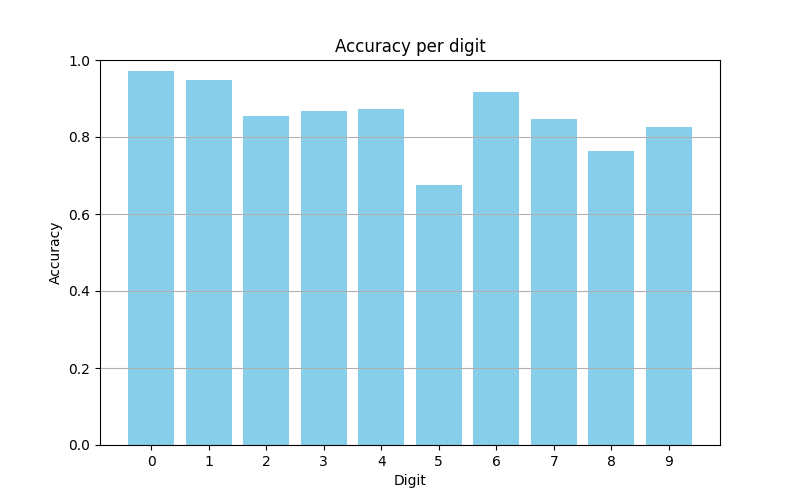
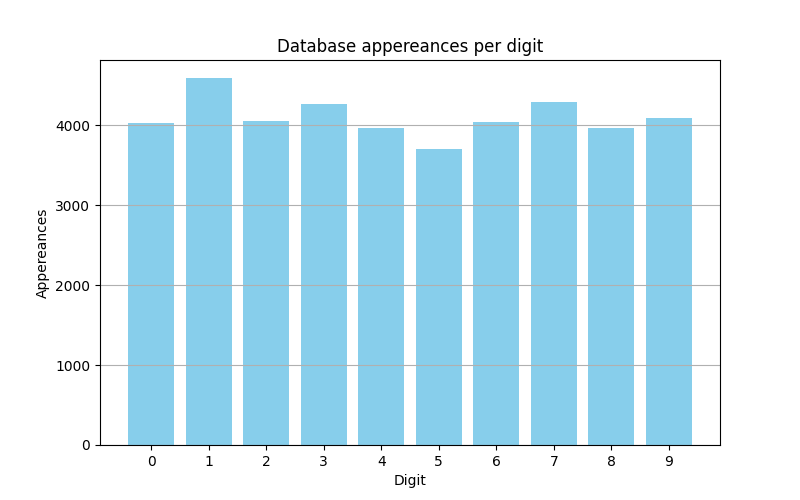
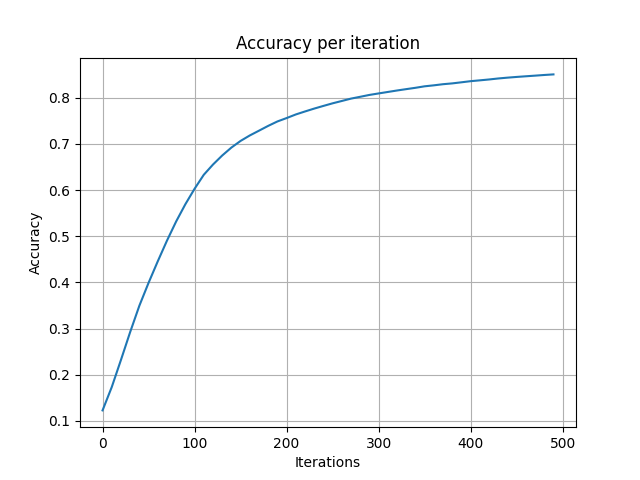

# Clasificación de dígitos
Red neuronal entrenada en la conocida base de datos [MNIST](https://www.kaggle.com/datasets/hojjatk/mnist-dataset), capaz de detectar dígitos manuscritos entre 0 y 9 con alta precisión.

## Resumen
He desarrollado desde cero una red neuronal, sin librerías de alto nivel como Tensorflow o PyTorch, con la intención de obtener una mejor perspectiva del funcionamiento de las redes neuronales. He implementado a mano los métodos `backward_prop` y `gradient_descent`, así como el resto de funciones matemáticas involucradas, si bien he utilizado `NumPy` por la optimización de operaciones vectoriales.

En cuanto a la arquitectura de la red, he planteado una estructura sencilla:
- Capa de entrada: contiene los píxeles de una imagen. La base de datos MNIST está compuestas por imágenes de 28x28 píxeles. Por tanto, si se trata de predecir (aplicar `gradient_descent`) a una imagen, esta capa tendrá $ 28^2 = 784 $ nodos. Estos nodos tienen valores entre 0 y 255, siendo 0 totalmente negro y 255 blanco. 
- Capa intermedia: permite expresar las capas exteriores como combinaciones no lineales mediante la función `ReLU`. Tiene 10 nodos.
- Capa de salida: predicción de la red. Está compuesta por 10 nodos, cada uno de ellos representando las 10 posibles predicciones. Las predicciones se normalizan para obtener probabilidades de acierto. Basta con quedarnos con la más alta de estas probabilidades, que será la predicción de la red.

## Precisión obtenida

He puesto además especial atención en la precisión obtenida. La siguiente figura describe la precisión de la red a la hora de predecir cada dígito:

Al detectar una oscilación relativamente grande, traté de relacionarlo con la frecuencia de aparición de los dígitos en el conjunto de entrenamiento:

## Precisión por iteración

La precisión obtenida, naturalmente, ha dependido del número de iteraciones de `backward_prop` realizadas actualizando parámetros y ajustando la red. He considerado relevante estudiar esta relación entre iteraciones y precisión, que creo que puede ser especialmente importante al trabajar con grandes bases de datos:

